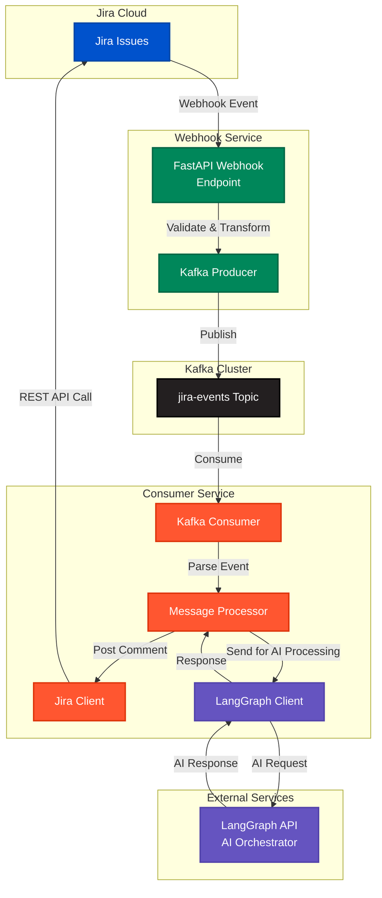
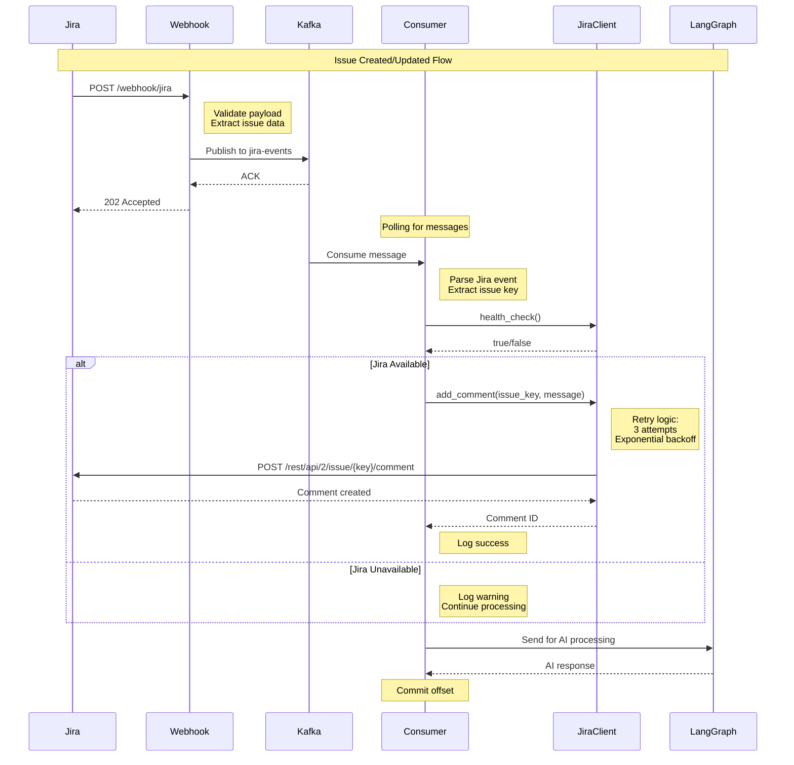

# Architecture Diagram - Jira Integration with Bidirectional Communication

## Complete System Architecture

## Detailed Flow Diagram

## Component Details

### 1. Jira Cloud
- **Purpose**: Source of webhook events
- **Events**: Issue created, updated, commented, etc.
- **API**: REST API v2/v3 for bidirectional communication

### 2. Webhook Service (FastAPI)
- **Port**: 8000
- **Endpoint**: POST /webhook/jira
- **Validation**: Pydantic models
- **Output**: Kafka messages

### 3. Kafka Cluster
- **Topic**: jira-events
- **Partitions**: Configurable
- **Replication**: Configurable
- **Retention**: 7 days (default)

### 4. Consumer Service
**Components:**
- **Kafka Consumer**: Polls messages from jira-events topic
- **Message Processor**: Orchestrates the processing flow
- **Jira Client**: Handles bidirectional Jira communication
  - Health checks
  - Comment posting
  - Retry logic (3 attempts, exponential backoff)
  - Error handling (401, 403, 404, 429)
- **LangGraph Client**: Sends events to AI orchestrator

### 5. LangGraph API
- **Purpose**: AI-powered issue analysis and response generation
- **Input**: Jira event data
- **Output**: AI-generated responses

## Data Flow

### Forward Flow (Jira → Consumer)
1. Jira issue created/updated
2. Webhook triggered → FastAPI
3. Payload validated → Kafka
4. Consumer polls message
5. Event parsed and processed

### Reverse Flow (Consumer → Jira)
1. Consumer receives Jira event
2. Health check performed
3. Acknowledgment comment posted
4. Success/failure logged

## Configuration

### Environment Variables

**Webhook Service:**
- KAFKA_BOOTSTRAP_SERVERS
- KAFKA_TOPIC
- LOG_LEVEL

**Consumer Service:**
- KAFKA_BOOTSTRAP_SERVERS
- KAFKA_TOPIC
- KAFKA_GROUP_ID
- JIRA_SERVER
- JIRA_EMAIL
- JIRA_API_TOKEN
- JIRA_ENABLED
- LANGGRAPH_API_URL
- LANGGRAPH_API_KEY

## Error Handling

### Jira Client Errors
- **401 Unauthorized**: Invalid API token
- **403 Forbidden**: No permission to comment
- **404 Not Found**: Issue doesn't exist
- **429 Rate Limited**: Too many requests
- **Network Errors**: Connection timeout, DNS failure

### Retry Strategy
- **Attempts**: 3
- **Backoff**: Exponential (4s, 8s, 16s)
- **Exceptions**: JIRAError only
- **Reraise**: Yes (after all retries exhausted)

## Monitoring Points

1. **Webhook Service**
   - Request count
   - Response times
   - Kafka publish success/failure

2. **Kafka**
   - Topic lag
   - Message throughput
   - Consumer group status

3. **Consumer Service**
   - Messages processed
   - Processing time
   - Jira API calls (success/failure)
   - LangGraph API calls

4. **Jira Client**
   - Comment post success rate
   - API latency
   - Error rates by type
   - Health check status

## Security Considerations

1. **API Tokens**: Stored in environment variables, never committed
2. **SSL/TLS**: Enabled for Jira API calls
3. **Authentication**: Basic auth with email + API token
4. **Permissions**: Requires comment permission on Jira issues

## Scalability

- **Horizontal Scaling**: Multiple consumer instances with same group ID
- **Partitioning**: Kafka topic can be partitioned for parallel processing
- **Rate Limiting**: Jira API has rate limits, handled by retry logic
- **Circuit Breaker**: Can be added for external API calls

## Future Enhancements

1. **Dead Letter Queue**: For failed messages
2. **Metrics**: Prometheus metrics for monitoring
3. **Tracing**: Distributed tracing with correlation IDs
4. **Advanced Jira Operations**:
   - Update issue fields
   - Add labels
   - Transition issues
   - Attach files
5. **AI Response Posting**: Post LangGraph responses as comments