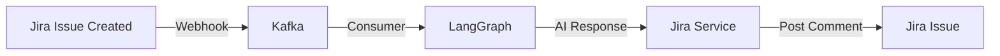

# Jira Service Design - Comment Push Integration

## Overview

This document outlines the design for adding a Jira service that connects to your Jira account using API keys to push comments back to Jira issues. This creates a bidirectional integration where LangGraph can respond to Jira events by posting comments.

## Use Case



**Flow:**
1. Jira issue created/updated → Webhook → Kafka
2. Consumer processes event → Sends to LangGraph
3. LangGraph generates AI response
4. Jira Service posts response as comment back to Jira

## Library Evaluation

### Option 1: `jira` (Official Atlassian Library) ✅ RECOMMENDED

**Package:** `atlassian-python-api` or `jira`

**Pros:**
- ✅ Official Atlassian support
- ✅ Comprehensive API coverage
- ✅ Well-documented
- ✅ Active maintenance
- ✅ Supports both Cloud and Server
- ✅ Built-in authentication handling
- ✅ Type hints available

**Cons:**
- ⚠️ Slightly heavier dependency
- ⚠️ Some legacy API patterns

**Installation:**
```bash
pip install jira
# or
poetry add jira
```

**Basic Usage:**
```python
from jira import JIRA

jira = JIRA(
    server='https://your-domain.atlassian.net',
    basic_auth=('email@example.com', 'api_token')
)

# Add comment
jira.add_comment('PROJ-123', 'This is a comment')
```

### Option 2: `atlassian-python-api` (Comprehensive)

**Pros:**
- ✅ Covers all Atlassian products
- ✅ Modern API design
- ✅ Good documentation

**Cons:**
- ⚠️ Overkill if only using Jira
- ⚠️ Larger dependency

### Option 3: Direct REST API with `httpx`

**Pros:**
- ✅ Full control
- ✅ Lightweight
- ✅ Already using httpx

**Cons:**
- ❌ More code to write
- ❌ Manual error handling
- ❌ Need to implement auth
- ❌ API changes require updates

**Recommendation:** Use `jira` library (Option 1) for faster development and better maintainability.

## Architecture Design

### 1. Service Location

Add to existing consumer project:

```
jira-consumer/
└── app/
    ├── clients/
    │   ├── langgraph_client.py
    │   └── jira_client.py          # NEW
    └── services/
        ├── processor_service.py
        └── jira_service.py          # NEW
```

### 2. Component Design

#### A. Jira Client (`app/clients/jira_client.py`)

**Responsibilities:**
- Manage Jira API connection
- Handle authentication
- Provide low-level API methods
- Retry logic for transient failures

**Methods:**
```python
class JiraClient:
    def __init__(self, server: str, email: str, api_token: str)
    def add_comment(self, issue_key: str, comment: str) -> dict
    def get_issue(self, issue_key: str) -> dict
    def update_issue(self, issue_key: str, fields: dict) -> dict
    def health_check() -> bool
```

#### B. Jira Service (`app/services/jira_service.py`)

**Responsibilities:**
- Business logic for Jira operations
- Format comments with context
- Handle LangGraph responses
- Error handling and logging

**Methods:**
```python
class JiraService:
    def post_langgraph_response(self, issue_key: str, response: str) -> bool
    def post_error_comment(self, issue_key: str, error: str) -> bool
    def format_comment(self, content: str, metadata: dict) -> str
```

### 3. Configuration

Add to `app/core/config.py`:

```python
class Settings(BaseSettings):
    # ... existing config ...
    
    # Jira Configuration
    jira_server: str = os.getenv("JIRA_SERVER", "")
    jira_email: str = os.getenv("JIRA_EMAIL", "")
    jira_api_token: str = os.getenv("JIRA_API_TOKEN", "")
    jira_enabled: bool = os.getenv("JIRA_ENABLED", "true").lower() == "true"
```

Add to `.env.example`:

```bash
# Jira Configuration
JIRA_SERVER=https://your-domain.atlassian.net
JIRA_EMAIL=your-email@example.com
JIRA_API_TOKEN=your-api-token-here
JIRA_ENABLED=true
```

## Implementation Plan

### Phase 1: Basic Jira Client (Day 1)

**Tasks:**
1. Add `jira` dependency to `pyproject.toml` and `requirements.txt`
2. Create `app/clients/jira_client.py`
3. Implement authentication and connection
4. Add `add_comment()` method
5. Add health check
6. Add unit tests

**Code Example:**

```python
"""Jira API client"""
from typing import Optional
from jira import JIRA
from jira.exceptions import JIRAError

from app.core.config import settings
from app.core.logging import get_logger

logger = get_logger(__name__)


class JiraClient:
    """Client for Jira API operations"""
    
    def __init__(self):
        """Initialize Jira client"""
        if not settings.jira_enabled:
            logger.warning("Jira integration is disabled")
            self.client = None
            return
        
        try:
            logger.info(f"Connecting to Jira at {settings.jira_server}")
            self.client = JIRA(
                server=settings.jira_server,
                basic_auth=(settings.jira_email, settings.jira_api_token)
            )
            logger.info("Successfully connected to Jira")
        except JIRAError as e:
            logger.error(f"Failed to connect to Jira: {str(e)}")
            raise
    
    def add_comment(self, issue_key: str, comment: str) -> Optional[dict]:
        """
        Add a comment to a Jira issue
        
        Args:
            issue_key: Issue key (e.g., 'PROJ-123')
            comment: Comment text
            
        Returns:
            Comment object or None if failed
        """
        if not self.client:
            logger.warning("Jira client not initialized")
            return None
        
        try:
            logger.info(f"Adding comment to {issue_key}")
            comment_obj = self.client.add_comment(issue_key, comment)
            logger.info(f"Successfully added comment to {issue_key}")
            return {
                "id": comment_obj.id,
                "body": comment_obj.body,
                "created": comment_obj.created
            }
        except JIRAError as e:
            logger.error(f"Failed to add comment to {issue_key}: {str(e)}")
            return None
    
    def health_check(self) -> bool:
        """Check if Jira connection is healthy"""
        if not self.client:
            return False
        
        try:
            # Try to get server info
            self.client.server_info()
            return True
        except Exception as e:
            logger.error(f"Jira health check failed: {str(e)}")
            return False
```

### Phase 2: Jira Service Layer (Day 2)

**Tasks:**
1. Create `app/services/jira_service.py`
2. Implement comment formatting
3. Add metadata to comments
4. Error handling
5. Integration tests

**Code Example:**

```python
"""Jira service for business logic"""
from typing import Optional
from datetime import datetime

from app.clients.jira_client import JiraClient
from app.core.logging import get_logger

logger = get_logger(__name__)


class JiraService:
    """Service for Jira operations"""
    
    def __init__(self):
        """Initialize Jira service"""
        self.client = JiraClient()
    
    def post_langgraph_response(
        self,
        issue_key: str,
        response: str,
        metadata: Optional[dict] = None
    ) -> bool:
        """
        Post LangGraph AI response as comment
        
        Args:
            issue_key: Jira issue key
            response: AI-generated response
            metadata: Optional metadata to include
            
        Returns:
            True if successful, False otherwise
        """
        try:
            # Format comment with metadata
            formatted_comment = self._format_comment(response, metadata)
            
            # Post comment
            result = self.client.add_comment(issue_key, formatted_comment)
            
            if result:
                logger.info(f"Posted LangGraph response to {issue_key}")
                return True
            else:
                logger.error(f"Failed to post response to {issue_key}")
                return False
                
        except Exception as e:
            logger.error(f"Error posting response to {issue_key}: {str(e)}")
            return False
    
    def post_error_comment(self, issue_key: str, error: str) -> bool:
        """
        Post error notification as comment
        
        Args:
            issue_key: Jira issue key
            error: Error message
            
        Returns:
            True if successful, False otherwise
        """
        try:
            comment = (
                f"⚠️ *Processing Error*\n\n"
                f"An error occurred while processing this issue:\n"
                f"{{code}}{error}{{code}}\n\n"
                f"_Timestamp: {datetime.utcnow().isoformat()}_"
            )
            
            result = self.client.add_comment(issue_key, comment)
            return result is not None
            
        except Exception as e:
            logger.error(f"Error posting error comment to {issue_key}: {str(e)}")
            return False
    
    def _format_comment(self, content: str, metadata: Optional[dict] = None) -> str:
        """
        Format comment with metadata
        
        Args:
            content: Main comment content
            metadata: Optional metadata
            
        Returns:
            Formatted comment string
        """
        # Build comment with Jira markdown
        comment_parts = [
            "🤖 *AI Assistant Response*",
            "",
            content,
            ""
        ]
        
        # Add metadata if provided
        if metadata:
            comment_parts.append("---")
            comment_parts.append("_Metadata:_")
            for key, value in metadata.items():
                comment_parts.append(f"• {key}: {value}")
        
        # Add timestamp
        comment_parts.append("")
        comment_parts.append(f"_Generated: {datetime.utcnow().isoformat()}_")
        
        return "\n".join(comment_parts)
```

### Phase 3: Integration with Processor (Day 3)

**Tasks:**
1. Update `app/services/processor_service.py`
2. Integrate Jira service
3. Add comment posting after LangGraph response
4. Handle errors gracefully
5. End-to-end testing

**Updated Processor:**

```python
"""Main processing service with Jira integration"""
import asyncio
from typing import Dict, Any

from app.models.jira_event import JiraEvent
from app.transformers.jira_transformer import JiraEventTransformer
from app.clients.langgraph_client import LangGraphClient
from app.services.jira_service import JiraService
from app.core.logging import get_logger

logger = get_logger(__name__)


class ProcessorService:
    """Service to process Jira events with LangGraph and Jira integration"""
    
    def __init__(self):
        """Initialize processor service"""
        self.transformer = JiraEventTransformer()
        self.langgraph_client = LangGraphClient()
        self.jira_service = JiraService()
        logger.info("Processor service initialized with Jira integration")
    
    async def process_event(self, event_data: Dict[str, Any]) -> bool:
        """
        Process a single Jira event
        
        Args:
            event_data: Raw event data from Kafka
            
        Returns:
            True if processed successfully, False otherwise
        """
        issue_key = None
        
        try:
            # Validate and parse event
            jira_event = JiraEvent(**event_data)
            issue_key = jira_event.issue.key
            
            logger.info(f"Processing event: {jira_event.webhookEvent} for issue {issue_key}")
            
            # Transform to LangGraph format
            langgraph_request = self.transformer.transform(jira_event)
            
            # Send to LangGraph
            response = await self.langgraph_client.send_event(langgraph_request)
            
            # Extract AI response
            ai_response = response.get("response", "")
            
            if ai_response:
                # Post response as comment to Jira
                metadata = {
                    "Event Type": jira_event.webhookEvent,
                    "Processed By": "LangGraph AI",
                    "Model": response.get("model", "unknown")
                }
                
                success = self.jira_service.post_langgraph_response(
                    issue_key,
                    ai_response,
                    metadata
                )
                
                if success:
                    logger.info(f"✓ Posted AI response to {issue_key}")
                else:
                    logger.warning(f"Failed to post response to {issue_key}")
            
            logger.info(f"Successfully processed event for issue {issue_key}")
            return True
            
        except Exception as e:
            logger.error(f"Failed to process event: {str(e)}", exc_info=True)
            
            # Try to post error comment to Jira
            if issue_key:
                self.jira_service.post_error_comment(issue_key, str(e))
            
            return False
```

## Configuration Guide

### 1. Get Jira API Token

1. Go to https://id.atlassian.com/manage-profile/security/api-tokens
2. Click "Create API token"
3. Give it a name (e.g., "LangGraph Consumer")
4. Copy the token (you won't see it again!)

### 2. Configure Environment

```bash
# .env file
JIRA_SERVER=https://your-domain.atlassian.net
JIRA_EMAIL=your-email@example.com
JIRA_API_TOKEN=your-api-token-here
JIRA_ENABLED=true
```

### 3. Test Connection

```python
# test_jira_connection.py
from app.clients.jira_client import JiraClient

client = JiraClient()
if client.health_check():
    print("✓ Jira connection successful!")
    
    # Test comment
    result = client.add_comment("TEST-1", "Test comment from consumer")
    if result:
        print(f"✓ Comment posted: {result['id']}")
else:
    print("✗ Jira connection failed")
```

## Security Considerations

### 1. API Token Storage

**DO:**
- ✅ Store in environment variables
- ✅ Use secrets management (AWS Secrets Manager, HashiCorp Vault)
- ✅ Rotate tokens regularly
- ✅ Use least privilege (only comment permission needed)

**DON'T:**
- ❌ Commit tokens to git
- ❌ Log tokens
- ❌ Share tokens

### 2. Rate Limiting

Jira Cloud has rate limits:
- 10 requests per second per user
- Implement exponential backoff
- Use retry logic

```python
from tenacity import retry, stop_after_attempt, wait_exponential

@retry(
    stop=stop_after_attempt(3),
    wait=wait_exponential(multiplier=1, min=4, max=10)
)
def add_comment_with_retry(self, issue_key: str, comment: str):
    return self.client.add_comment(issue_key, comment)
```

## Testing Strategy

### 1. Unit Tests

```python
# tests/unit/test_jira_client.py
def test_add_comment(mock_jira):
    client = JiraClient()
    result = client.add_comment("TEST-1", "Test comment")
    assert result is not None
    assert result["body"] == "Test comment"
```

### 2. Integration Tests

```python
# tests/integration/test_jira_integration.py
@pytest.mark.integration
def test_end_to_end_comment_posting():
    # Process event
    # Verify comment appears in Jira
    pass
```

### 3. Manual Testing

```bash
# Send test event
curl -X POST http://localhost:8000/webhook/jira \
  -H "Content-Type: application/json" \
  -d @test_payload.json

# Check Jira issue for comment
```

## Monitoring & Observability

### Metrics to Track

```python
# Add to app/core/metrics.py
jira_comments_posted = Counter(
    'jira_comments_posted_total',
    'Total comments posted to Jira'
)

jira_comments_failed = Counter(
    'jira_comments_failed_total',
    'Failed comment posts to Jira'
)

jira_api_latency = Histogram(
    'jira_api_latency_seconds',
    'Jira API call latency'
)
```

### Logging

```python
logger.info(f"Posting comment to {issue_key}")
logger.debug(f"Comment content: {comment[:100]}...")
logger.info(f"✓ Comment posted: {comment_id}")
logger.error(f"Failed to post comment: {error}")
```

## Error Handling

### Scenarios to Handle

1. **Authentication Failure**
   - Invalid API token
   - Expired token
   - Wrong email

2. **Permission Errors**
   - No permission to comment
   - Issue doesn't exist
   - Project access denied

3. **Network Errors**
   - Timeout
   - Connection refused
   - DNS failure

4. **Rate Limiting**
   - Too many requests
   - Implement backoff

### Error Handling Strategy

```python
try:
    result = jira_client.add_comment(issue_key, comment)
except JIRAError as e:
    if e.status_code == 401:
        logger.error("Authentication failed - check API token")
    elif e.status_code == 403:
        logger.error("Permission denied - check user permissions")
    elif e.status_code == 404:
        logger.error(f"Issue {issue_key} not found")
    elif e.status_code == 429:
        logger.warning("Rate limited - backing off")
        # Implement backoff
    else:
        logger.error(f"Jira API error: {e}")
```

## Deployment Checklist

- [ ] Add `jira` to dependencies
- [ ] Create Jira API token
- [ ] Configure environment variables
- [ ] Test connection
- [ ] Implement client
- [ ] Implement service
- [ ] Integrate with processor
- [ ] Add unit tests
- [ ] Add integration tests
- [ ] Update documentation
- [ ] Deploy and monitor

## Alternative: Webhook Response

Instead of posting comments, you could also:

1. **Update Issue Fields**
   ```python
   jira.update_issue(issue_key, fields={"customfield_10001": ai_response})
   ```

2. **Add Labels**
   ```python
   issue = jira.issue(issue_key)
   issue.fields.labels.append('ai-processed')
   issue.update(fields={"labels": issue.fields.labels})
   ```

3. **Transition Issue**
   ```python
   jira.transition_issue(issue_key, '31')  # Transition to "In Progress"
   ```

## Conclusion

**Recommended Approach:**
1. Use `jira` Python library
2. Add to existing consumer project
3. Implement in phases (client → service → integration)
4. Focus on comment posting initially
5. Expand to other operations as needed

**Benefits:**
- ✅ Complete feedback loop
- ✅ AI responses visible in Jira
- ✅ Audit trail of AI interactions
- ✅ Team collaboration enabled
- ✅ Extensible for future features

**Next Steps:**
1. Install `jira` library
2. Get API token from Jira
3. Implement JiraClient
4. Test connection
5. Integrate with processor