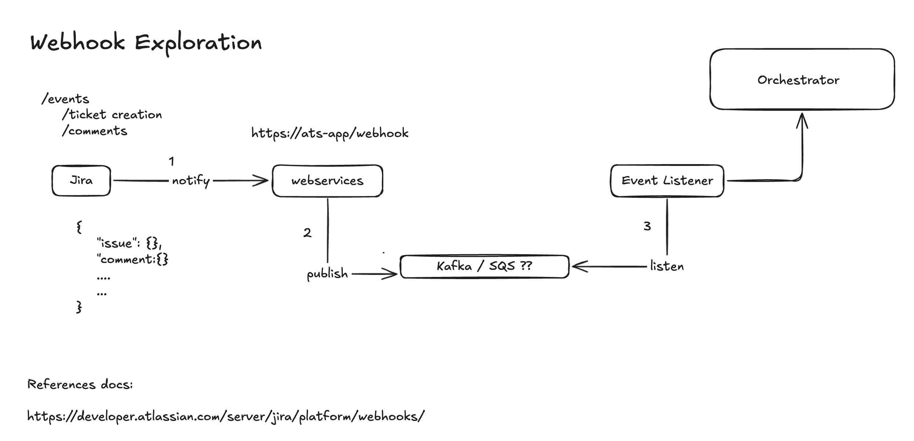

# Jira Webhook to Kafka POC

A FastAPI-based webhook service that receives Jira webhook events and publishes them to Apache Kafka.

## Features

- ✅ FastAPI webhook endpoint for Jira events
- ✅ Pydantic models for payload validation
- ✅ Kafka producer with connection retry logic
- ✅ Docker Compose setup for Kafka + Zookeeper
- ✅ Comprehensive error handling
- ✅ Health check endpoints
- ✅ Kafka UI for monitoring (accessible at http://localhost:8080)
- ✅ Poetry for dependency management

## Architecture

### Flow Diagram



### Data Flow

```
Jira → POST /webhook/jira → FastAPI → Validate Payload → Kafka Producer → Kafka Topic (jira-events)
```

The diagram above shows the complete flow of the POC:
1. **Jira** sends webhook events when issues are created/updated
2. **FastAPI** receives and validates the webhook payload
3. **Kafka Producer** publishes the event to Kafka
4. **Kafka Topic** stores the events for downstream consumers

## Prerequisites

- Python 3.12+
- Docker and Docker Compose
- Poetry (Python dependency manager)

## Project Structure

```
webhook/
├── app/
│   ├── __init__.py           # Package initialization
│   ├── main.py               # FastAPI application
│   ├── models.py             # Pydantic models for Jira payload
│   ├── kafka_producer.py     # Kafka producer with retry logic
│   └── config.py             # Configuration settings
├── docker-compose.yml        # Kafka + Zookeeper setup
├── requirements.txt          # Python dependencies
├── .env.example              # Environment variables template
├── .gitignore                # Git ignore rules

## 📁 Project Structure

The project follows a production-ready, scalable architecture:
```
webhook/
├── app/
│   ├── api/              # API layer with versioning
│   │   ├── dependencies.py
│   │   └── v1/
│   │       ├── endpoints/
│   │       │   ├── webhooks.py
│   │       │   └── health.py
│   │       └── router.py
│   ├── core/             # Core functionality
│   │   ├── config.py
│   │   └── logging.py
│   ├── models/           # Data models
│   │   └── jira.py
│   ├── schemas/          # Request/Response schemas
│   │   ├── webhook.py
│   │   └── health.py
│   ├── services/         # Business logic
│   │   ├── kafka_service.py
│   │   └── webhook_service.py
│   └── main.py           # FastAPI app initialization
├── docs/                 # Documentation
│   ├── guides/
│   │   └── DEBUGGING_GUIDE.md
│   ├── development/
│   │   ├── FOLDER_STRUCTURE.md
│   │   ├── REFACTORING_SUMMARY.md
│   │   └── CLEANUP_SUMMARY.md
│   └── images/
│       └── architecture-diagram.png
├── tests/                # Test suite
│   ├── unit/
│   └── integration/
├── docker-compose.yml
├── pyproject.toml
├── requirements.txt
└── README.md             # This file
```

**Key Benefits:**
- ✅ Clear separation of concerns
- ✅ Easy to test and maintain
- ✅ Scalable architecture
- ✅ API versioning support
- ✅ Dependency injection pattern

## 📚 Documentation

- **[Folder Structure Guide](docs/development/FOLDER_STRUCTURE.md)** - Detailed explanation of project organization
- **[Refactoring Summary](docs/development/REFACTORING_SUMMARY.md)** - History of architectural improvements
- **[Cleanup Summary](docs/development/CLEANUP_SUMMARY.md)** - Documentation cleanup details
- **[Debugging Guide](docs/guides/DEBUGGING_GUIDE.md)** - Troubleshooting webhook validation errors

## Setup Instructions

### 1. Install Poetry

If you don't have Poetry installed, install it first:

```bash
# macOS/Linux/WSL
curl -sSL https://install.python-poetry.org | python3 -

# Windows (PowerShell)
(Invoke-WebRequest -Uri https://install.python-poetry.org -UseBasicParsing).Content | py -

# Or using pip
pip install poetry
```

Verify installation:
```bash
poetry --version
```

### 2. Clone and Navigate to Project

```bash
cd webhook
```

### 3. Install Dependencies with Poetry

```bash
# Install all dependencies (including dev dependencies)
poetry install

# Install only production dependencies
poetry install --no-dev
```

This will create a virtual environment automatically and install all dependencies.

### 4. Activate Poetry Shell (Optional)

```bash
poetry shell
```

Alternatively, you can run commands with `poetry run` prefix without activating the shell.

### 5. Configure Environment Variables (Optional)

```bash
cp .env.example .env
# Edit .env if you need to customize settings
```

### 6. Start Kafka and Zookeeper

```bash
docker-compose up -d
```

Wait for services to be healthy (about 30-60 seconds):

```bash
docker-compose ps
```

You should see all services as "healthy".

### 7. Start FastAPI Application

Using Poetry:

```bash
# Option 1: Using poetry run
poetry run uvicorn app.main:app --reload --host 0.0.0.0 --port 8000

# Option 2: Activate shell first, then run
poetry shell
uvicorn app.main:app --reload --host 0.0.0.0 --port 8000
```

Without Poetry (using pip and requirements.txt):

```bash
# Create virtual environment
python3 -m venv venv
source venv/bin/activate  # On Windows: venv\Scripts\activate

# Install dependencies
pip install -r requirements.txt

# Run application
uvicorn app.main:app --reload --host 0.0.0.0 --port 8000
```

The API will be available at:
- **API**: http://localhost:8000
- **API Docs**: http://localhost:8000/docs
- **Kafka UI**: http://localhost:8080

## API Endpoints

### 1. Root Endpoint
```bash
GET http://localhost:8000/
```

Returns service status and Kafka connection state.

### 2. Health Check
```bash
GET http://localhost:8000/health
```

Returns health status of the service and Kafka connection.

### 3. Jira Webhook Endpoint
```bash
POST http://localhost:8000/webhook/jira
Content-Type: application/json
```

Receives Jira webhook events and publishes to Kafka.

## Testing the Webhook

### Using curl

```bash
curl -X POST http://localhost:8000/webhook/jira \
  -H "Content-Type: application/json" \
  -d '{
    "timestamp": 1713782400000,
    "webhookEvent": "jira:issue_created",
    "user": {
      "self": "https://your-jira/rest/api/2/user?username=charles",
      "name": "charles",
      "displayName": "Charles D",
      "emailAddress": "charles@example.com"
    },
    "issue": {
      "id": "10001",
      "self": "https://your-jira/rest/api/2/issue/10001",
      "key": "PROJ-123",
      "fields": {
        "summary": "API returns 500 on login",
        "description": "Steps to reproduce...",
        "issuetype": {
          "id": "10004",
          "name": "Bug"
        },
        "project": {
          "id": "10000",
          "key": "PROJ",
          "name": "Project Alpha"
        },
        "reporter": {
          "name": "charles",
          "displayName": "Charles D"
        },
        "creator": {
          "name": "charles",
          "displayName": "Charles D"
        },
        "priority": {
          "id": "3",
          "name": "Medium"
        },
        "status": {
          "id": "1",
          "name": "To Do"
        }
      }
    }
  }'
```

### Expected Response (202 Accepted)

```json
{
  "status": "accepted",
  "message": "Webhook event received and published to Kafka",
  "issue_key": "PROJ-123",
  "webhook_event": "jira:issue_created",
  "kafka_topic": "jira-events"
}
```

## Verifying Messages in Kafka

### Option 1: Using Kafka UI (Recommended)

1. Open http://localhost:8080 in your browser
2. Navigate to Topics → jira-events
3. View messages in the Messages tab

### Option 2: Using Kafka Console Consumer

```bash
docker exec -it kafka kafka-console-consumer \
  --bootstrap-server localhost:9092 \
  --topic jira-events \
  --from-beginning \
  --property print.key=true \
  --property print.value=true
```

Press `Ctrl+C` to stop the consumer.

## Error Handling

The API handles various error scenarios:

| Status Code | Scenario | Description |
|-------------|----------|-------------|
| 202 | Success | Message accepted and published to Kafka |
| 422 | Validation Error | Invalid payload structure |
| 503 | Service Unavailable | Kafka broker not available |
| 500 | Internal Error | Unexpected error during processing |

### Example Error Response (503)

```json
{
  "detail": {
    "error": "Service Unavailable",
    "message": "Kafka broker is not available. Please try again later.",
    "retry_after": 60
  }
}
```

## Configuration

Environment variables (defined in `.env` or system environment):

| Variable | Default | Description |
|----------|---------|-------------|
| `KAFKA_BOOTSTRAP_SERVERS` | `localhost:9092` | Kafka broker address |
| `KAFKA_TOPIC` | `jira-events` | Kafka topic name |
| `KAFKA_MAX_RETRIES` | `3` | Max connection retry attempts |
| `KAFKA_RETRY_BACKOFF_MS` | `1000` | Retry backoff in milliseconds |
| `KAFKA_REQUEST_TIMEOUT_MS` | `30000` | Request timeout in milliseconds |
| `LOG_LEVEL` | `INFO` | Logging level (DEBUG, INFO, WARNING, ERROR) |

## Monitoring and Debugging

### View Application Logs

The FastAPI application logs all events:

```bash
# Application logs are printed to stdout
# Look for messages like:
# INFO - Received Jira webhook event: jira:issue_created for issue PROJ-123
# INFO - Successfully published message for issue PROJ-123 to Kafka
```

### View Kafka Logs

```bash
docker-compose logs -f kafka
```

### View Zookeeper Logs

```bash
docker-compose logs -f zookeeper
```

### Check Kafka Topics

```bash
docker exec -it kafka kafka-topics \
  --bootstrap-server localhost:9092 \
  --list
```

## Stopping the Services

### Stop FastAPI

Press `Ctrl+C` in the terminal running uvicorn.

### Stop Kafka and Zookeeper

```bash
docker-compose down
```

To also remove volumes (delete all Kafka data):

```bash
docker-compose down -v
```

## Troubleshooting

### Issue: Kafka connection fails

**Solution**: Ensure Kafka is running and healthy:
```bash
docker-compose ps
docker-compose logs kafka
```

### Issue: Port 9092 already in use

**Solution**: Stop any existing Kafka instances or change the port in `docker-compose.yml`.

### Issue: Messages not appearing in Kafka

**Solution**:
1. Check application logs for errors
2. Verify Kafka topic exists: `docker exec -it kafka kafka-topics --bootstrap-server localhost:9092 --list`
3. Check Kafka UI at http://localhost:8080

### Issue: Import errors when running the application

**Solution with Poetry**:
```bash
# Ensure dependencies are installed
poetry install

# Run with poetry
poetry run uvicorn app.main:app --reload
```

**Solution with pip**:
```bash
# Ensure virtual environment is activated and dependencies are installed
source venv/bin/activate
pip install -r requirements.txt
```

## Development

### Running Tests

With Poetry:
```bash
# Install dev dependencies (if not already installed)
poetry install

# Run tests (to be implemented)
poetry run pytest

# Run tests with coverage
poetry run pytest --cov=app
```

With pip:
```bash
# Install test dependencies
pip install pytest pytest-asyncio httpx

# Run tests (to be implemented)
pytest
```

### Code Formatting and Linting

With Poetry:
```bash
# Format code with Black
poetry run black app/

# Run linting with flake8
poetry run flake8 app/

# Type checking with mypy
poetry run mypy app/
```

### Adding New Dependencies

With Poetry:
```bash
# Add production dependency
poetry add package-name

# Add development dependency
poetry add --group dev package-name

# Update poetry.lock
poetry lock

# Export to requirements.txt (for compatibility)
poetry export -f requirements.txt --output requirements.txt --without-hashes
```

### API Documentation

Interactive API documentation is available at:
- **Swagger UI**: http://localhost:8000/docs
- **ReDoc**: http://localhost:8000/redoc

## Production Considerations

For production deployment, consider:

1. **Authentication**: Add API key or HMAC signature validation
2. **Rate Limiting**: Implement rate limiting to prevent abuse
3. **Monitoring**: Add Prometheus metrics and alerting
4. **Logging**: Use structured logging with correlation IDs
5. **Kafka Configuration**: 
   - Use multiple brokers for high availability
   - Configure appropriate replication factors
   - Enable SSL/TLS encryption
6. **Error Handling**: Implement dead letter queue for failed messages
7. **Scaling**: Run multiple FastAPI instances behind a load balancer

## License

This is a POC (Proof of Concept) project.

## Support

For issues or questions, please check the logs and troubleshooting section above.