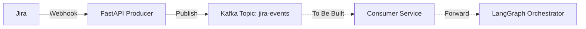
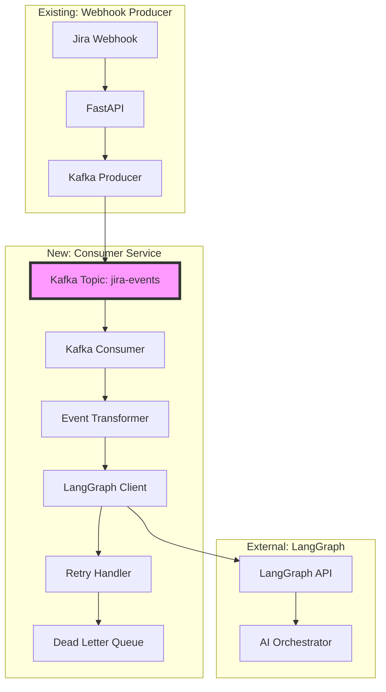

# Kafka Consumer Architecture Plan for LangGraph Integration

## Executive Summary

This document provides architectural recommendations for building a Kafka consumer that processes Jira webhook events and forwards them to a LangGraph orchestrator for AI-powered processing.

## Current Architecture



## Use Case Analysis

**Goal**: Transform Jira events from Kafka and forward them to a LangGraph orchestrator for intelligent processing.

**Key Requirements**:
- Consume messages from `jira-events` topic
- Transform/enrich Jira event data
- Forward to LangGraph orchestrator API
- Handle failures and retries
- Monitor processing status

## Architecture Decision: Separate Project vs Monorepo

### Option 1: Separate Project (RECOMMENDED ✅)

**Structure**:
```
ai-learning/
├── webhook/                    # Existing producer service
│   └── app/
└── jira-consumer/             # New consumer service
    ├── app/
    │   ├── consumers/
    │   ├── transformers/
    │   ├── clients/
    │   └── main.py
    └── docker-compose.yml
```

**Pros**:
- ✅ **Independent deployment** - Deploy consumer without affecting producer
- ✅ **Separate scaling** - Scale consumer independently based on load
- ✅ **Technology flexibility** - Use different frameworks/languages if needed
- ✅ **Clear separation of concerns** - Producer and consumer have different lifecycles
- ✅ **Easier testing** - Test consumer in isolation
- ✅ **Different dependencies** - Consumer may need LangGraph SDK, AI libraries
- ✅ **Fault isolation** - Consumer failures don't affect webhook ingestion

**Cons**:
- ❌ Duplicate configuration (Kafka settings)
- ❌ Separate deployment pipeline
- ❌ More repositories to manage

**When to Choose**:
- Consumer and producer have different scaling needs
- Consumer will be maintained by different team
- Consumer may use different tech stack
- You want maximum flexibility and isolation

### Option 2: Monorepo with Separate Services

**Structure**:
```
ai-learning/
└── jira-kafka-platform/
    ├── producer/              # Webhook service
    ├── consumer/              # Consumer service
    ├── shared/                # Shared models, utils
    └── docker-compose.yml     # Both services
```

**Pros**:
- ✅ Shared code (models, utilities)
- ✅ Single repository
- ✅ Unified deployment
- ✅ Easier local development

**Cons**:
- ❌ Coupled deployment
- ❌ Harder to scale independently
- ❌ Changes affect both services

### Option 3: Integrated Service (NOT RECOMMENDED ❌)

**Structure**:
```
webhook/
└── app/
    ├── api/          # Webhook endpoints
    ├── consumers/    # Kafka consumers
    └── main.py       # Both producer and consumer
```

**Why Not Recommended**:
- ❌ Violates single responsibility principle
- ❌ Consumer blocks webhook processing
- ❌ Cannot scale independently
- ❌ Deployment affects both functions
- ❌ Different failure modes mixed together

## Recommended Architecture: Separate Consumer Service

### High-Level Design



### Component Breakdown

#### 1. Kafka Consumer Service
**Responsibilities**:
- Subscribe to `jira-events` topic
- Consume messages in batches
- Handle consumer group management
- Commit offsets after successful processing

**Technology**: Python with `kafka-python` or `confluent-kafka`

#### 2. Event Transformer
**Responsibilities**:
- Parse Jira event payload
- Extract relevant fields
- Enrich with metadata
- Format for LangGraph API

**Example Transformation**:
```python
# Input: Jira webhook event
{
  "webhookEvent": "jira:issue_created",
  "issue": {
    "key": "PROJ-123",
    "fields": {
      "summary": "API returns 500",
      "description": "Steps to reproduce..."
    }
  }
}

# Output: LangGraph request
{
  "event_type": "jira_issue_created",
  "issue_key": "PROJ-123",
  "context": {
    "summary": "API returns 500",
    "description": "Steps to reproduce...",
    "priority": "High"
  },
  "metadata": {
    "source": "jira",
    "timestamp": "2024-04-25T10:30:00Z"
  }
}
```

#### 3. LangGraph Client
**Responsibilities**:
- HTTP client for LangGraph API
- Request/response handling
- Authentication management
- Timeout configuration

#### 4. Retry Handler
**Responsibilities**:
- Exponential backoff for failed requests
- Circuit breaker pattern
- Dead letter queue for permanent failures

#### 5. Monitoring & Observability
**Components**:
- Prometheus metrics (messages processed, errors, latency)
- Structured logging
- Health check endpoint
- Consumer lag monitoring

## Detailed Service Design

### Project Structure

```
jira-consumer/
├── app/
│   ├── __init__.py
│   ├── main.py                    # Application entry point
│   ├── core/
│   │   ├── config.py              # Configuration
│   │   └── logging.py             # Logging setup
│   ├── consumers/
│   │   ├── __init__.py
│   │   └── jira_consumer.py       # Kafka consumer logic
│   ├── transformers/
│   │   ├── __init__.py
│   │   └── jira_transformer.py    # Event transformation
│   ├── clients/
│   │   ├── __init__.py
│   │   └── langgraph_client.py    # LangGraph API client
│   ├── models/
│   │   ├── __init__.py
│   │   ├── jira_event.py          # Input models
│   │   └── langgraph_request.py   # Output models
│   └── services/
│       ├── __init__.py
│       └── processor_service.py   # Orchestration logic
├── tests/
│   ├── unit/
│   └── integration/
├── docker-compose.yml
├── Dockerfile
├── pyproject.toml
├── requirements.txt
└── README.md
```

### Key Components Implementation

#### Consumer Service (`consumers/jira_consumer.py`)

```python
from kafka import KafkaConsumer
import json

class JiraEventConsumer:
    def __init__(self, bootstrap_servers, topic, group_id):
        self.consumer = KafkaConsumer(
            topic,
            bootstrap_servers=bootstrap_servers,
            group_id=group_id,
            auto_offset_reset='earliest',
            enable_auto_commit=False,
            value_deserializer=lambda m: json.loads(m.decode('utf-8'))
        )
    
    def consume(self, processor_callback):
        """Consume messages and process with callback"""
        for message in self.consumer:
            try:
                # Process message
                processor_callback(message.value)
                
                # Commit offset after successful processing
                self.consumer.commit()
                
            except Exception as e:
                logger.error(f"Error processing message: {e}")
                # Handle error (retry, DLQ, etc.)
```

#### Transformer (`transformers/jira_transformer.py`)

```python
class JiraEventTransformer:
    def transform(self, jira_event: dict) -> dict:
        """Transform Jira event to LangGraph format"""
        return {
            "event_type": self._map_event_type(jira_event["webhookEvent"]),
            "issue_key": jira_event["issue"]["key"],
            "context": {
                "summary": jira_event["issue"]["fields"]["summary"],
                "description": jira_event["issue"]["fields"].get("description"),
                "priority": jira_event["issue"]["fields"]["priority"]["name"],
                "status": jira_event["issue"]["fields"]["status"]["name"],
                "issue_type": jira_event["issue"]["fields"]["issuetype"]["name"]
            },
            "metadata": {
                "source": "jira",
                "timestamp": jira_event["timestamp"],
                "user": jira_event["user"]["displayName"]
            }
        }
```

#### LangGraph Client (`clients/langgraph_client.py`)

```python
import httpx
from tenacity import retry, stop_after_attempt, wait_exponential

class LangGraphClient:
    def __init__(self, base_url: str, api_key: str):
        self.base_url = base_url
        self.client = httpx.AsyncClient(
            headers={"Authorization": f"Bearer {api_key}"},
            timeout=30.0
        )
    
    @retry(
        stop=stop_after_attempt(3),
        wait=wait_exponential(multiplier=1, min=4, max=10)
    )
    async def send_event(self, event: dict) -> dict:
        """Send event to LangGraph orchestrator"""
        response = await self.client.post(
            f"{self.base_url}/orchestrate",
            json=event
        )
        response.raise_for_status()
        return response.json()
```

### Configuration

```python
# app/core/config.py
from pydantic_settings import BaseSettings

class Settings(BaseSettings):
    # Kafka Configuration
    kafka_bootstrap_servers: str = "localhost:9092"
    kafka_topic: str = "jira-events"
    kafka_group_id: str = "jira-consumer-group"
    
    # LangGraph Configuration
    langgraph_api_url: str
    langgraph_api_key: str
    
    # Processing Configuration
    batch_size: int = 10
    max_retries: int = 3
    
    # Dead Letter Queue
    dlq_topic: str = "jira-events-dlq"
    
    class Config:
        env_file = ".env"
```

## Deployment Strategy

### Docker Compose Setup

```yaml
version: '3.8'

services:
  jira-consumer:
    build: .
    container_name: jira-consumer
    environment:
      - KAFKA_BOOTSTRAP_SERVERS=kafka:29092
      - KAFKA_TOPIC=jira-events
      - LANGGRAPH_API_URL=${LANGGRAPH_API_URL}
      - LANGGRAPH_API_KEY=${LANGGRAPH_API_KEY}
    depends_on:
      - kafka
    networks:
      - kafka-network
    restart: unless-stopped

networks:
  kafka-network:
    external: true
```

### Scaling Considerations

**Horizontal Scaling**:
- Run multiple consumer instances
- Each instance joins same consumer group
- Kafka automatically distributes partitions

**Vertical Scaling**:
- Increase batch size
- Adjust processing threads
- Optimize transformation logic

## Error Handling Strategy

### 1. Transient Errors (Retry)
- Network timeouts
- LangGraph API temporary unavailability
- Rate limiting

**Strategy**: Exponential backoff with max 3 retries

### 2. Permanent Errors (Dead Letter Queue)
- Invalid event format
- LangGraph API rejects event
- Transformation failures

**Strategy**: Send to DLQ topic for manual review

### 3. Consumer Failures
- Kafka connection lost
- Consumer crashes

**Strategy**: Auto-restart with Docker, consumer group rebalancing

## Monitoring & Observability

### Metrics to Track

```python
# Prometheus metrics
messages_consumed_total = Counter('messages_consumed_total')
messages_processed_success = Counter('messages_processed_success')
messages_failed_total = Counter('messages_failed_total')
processing_duration_seconds = Histogram('processing_duration_seconds')
langgraph_api_latency = Histogram('langgraph_api_latency_seconds')
consumer_lag = Gauge('consumer_lag')
```

### Health Checks

```python
@app.get("/health")
async def health_check():
    return {
        "status": "healthy",
        "kafka_connected": consumer.is_connected(),
        "langgraph_reachable": await langgraph_client.health_check(),
        "consumer_lag": get_consumer_lag()
    }
```

## Implementation Roadmap

### Phase 1: Basic Consumer (Week 1)
- [ ] Set up project structure
- [ ] Implement basic Kafka consumer
- [ ] Add event transformation logic
- [ ] Create LangGraph client stub
- [ ] Add logging and basic error handling

### Phase 2: Reliability (Week 2)
- [ ] Implement retry logic with exponential backoff
- [ ] Add dead letter queue
- [ ] Implement circuit breaker
- [ ] Add health check endpoint
- [ ] Create Docker setup

### Phase 3: Observability (Week 3)
- [ ] Add Prometheus metrics
- [ ] Implement structured logging
- [ ] Add consumer lag monitoring
- [ ] Create Grafana dashboards
- [ ] Set up alerting

### Phase 4: Production Readiness (Week 4)
- [ ] Load testing
- [ ] Security hardening
- [ ] Documentation
- [ ] Deployment automation
- [ ] Runbook creation

## Decision Matrix

| Criteria | Separate Project | Monorepo | Integrated |
|----------|-----------------|----------|------------|
| **Deployment Independence** | ✅ Excellent | ⚠️ Moderate | ❌ Poor |
| **Scaling Flexibility** | ✅ Excellent | ⚠️ Moderate | ❌ Poor |
| **Code Reuse** | ❌ Limited | ✅ Excellent | ✅ Good |
| **Operational Complexity** | ⚠️ Higher | ⚠️ Moderate | ✅ Lower |
| **Fault Isolation** | ✅ Excellent | ✅ Good | ❌ Poor |
| **Development Speed** | ⚠️ Slower | ✅ Faster | ✅ Fastest |
| **Maintenance** | ⚠️ More repos | ✅ Single repo | ✅ Simple |
| **Team Autonomy** | ✅ High | ⚠️ Moderate | ❌ Low |

## Final Recommendation

### ✅ Choose: Separate Project

**Rationale**:
1. **Different Lifecycles**: Producer handles real-time webhooks; consumer processes asynchronously
2. **Independent Scaling**: Consumer may need more instances during high load
3. **Technology Flexibility**: Consumer may need LangGraph SDK, AI libraries not needed by producer
4. **Fault Isolation**: Consumer issues won't affect webhook ingestion
5. **Clear Ownership**: Different teams can own producer vs consumer

**Project Name**: `jira-consumer`

**Location**: `ai-learning/jira-consumer/`

## Next Steps

1. **Create new project structure** for consumer service
2. **Set up development environment** with Kafka connection
3. **Implement basic consumer** with transformation logic
4. **Integrate LangGraph client** with retry handling
5. **Add monitoring and observability**
6. **Deploy and test** with real Jira events

## Questions to Consider

Before implementation, clarify:
- What is the LangGraph API endpoint and authentication method?
- What format does LangGraph expect for events?
- What is the expected throughput (events per second)?
- What are the SLA requirements for processing latency?
- Should we support multiple LangGraph orchestrators?
- What happens if LangGraph is down for extended periods?

## References

- [Kafka Consumer Best Practices](https://kafka.apache.org/documentation/#consumerconfigs)
- [LangGraph Documentation](https://langchain-ai.github.io/langgraph/)
- [Circuit Breaker Pattern](https://martinfowler.com/bliki/CircuitBreaker.html)
- [Dead Letter Queue Pattern](https://www.enterpriseintegrationpatterns.com/patterns/messaging/DeadLetterChannel.html)